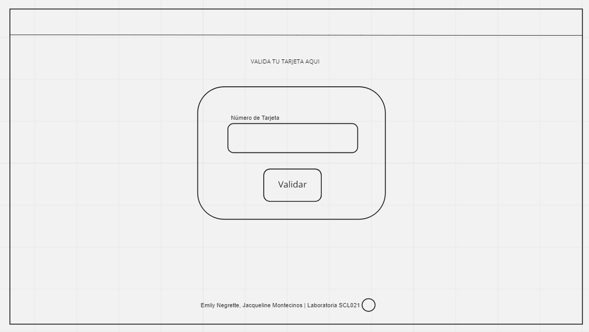
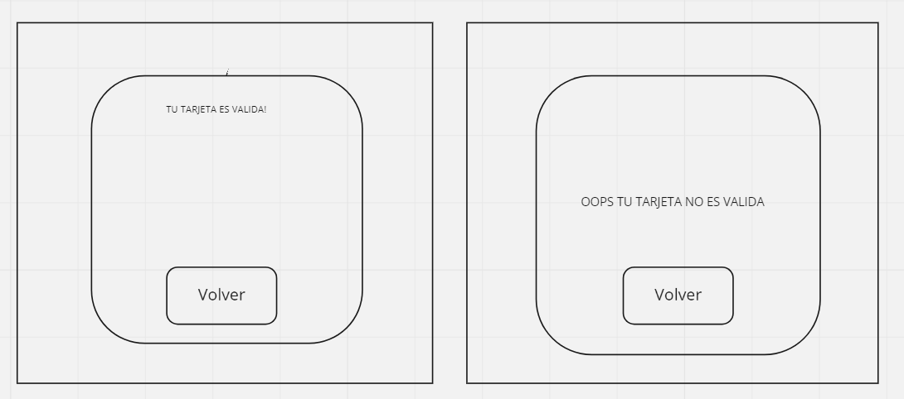
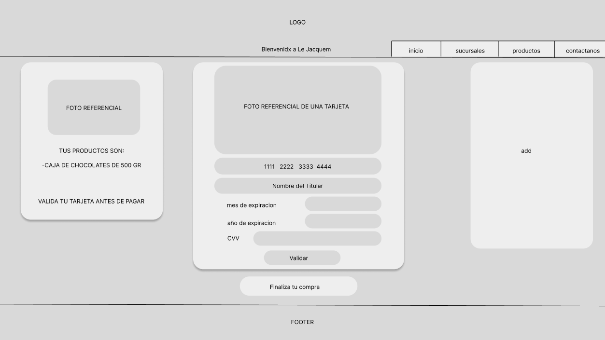
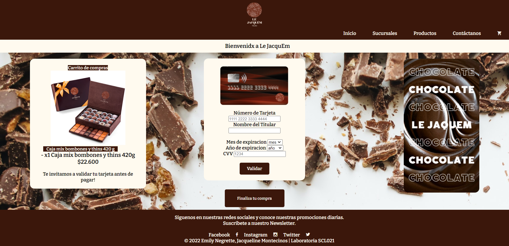
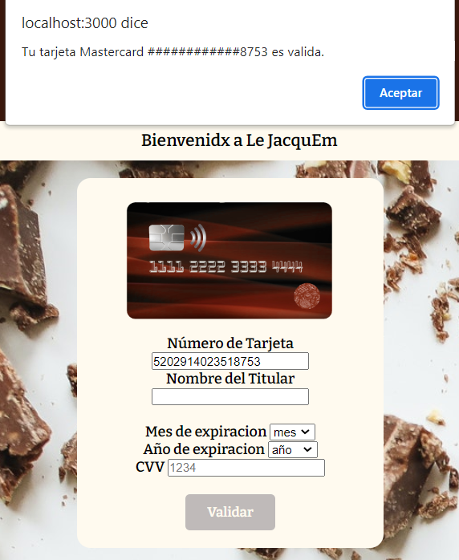
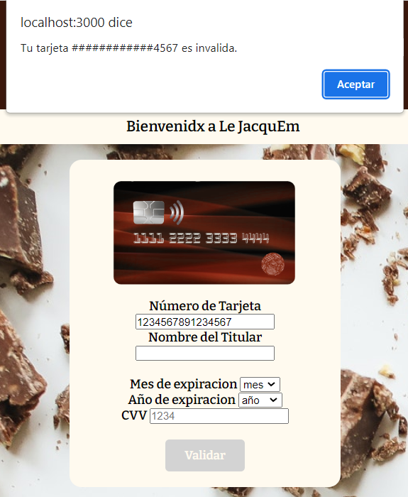
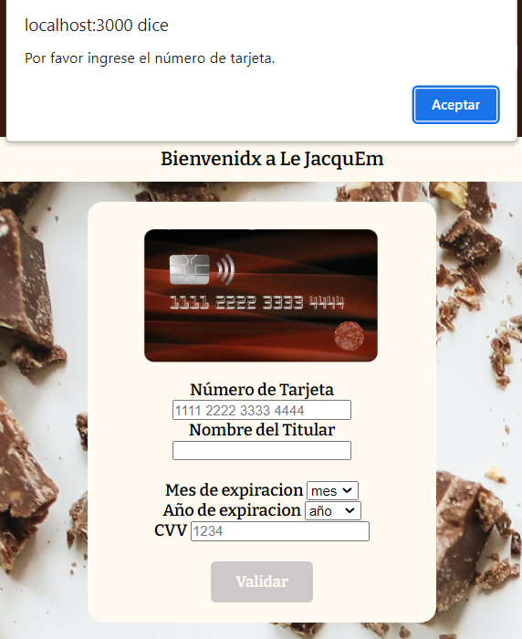
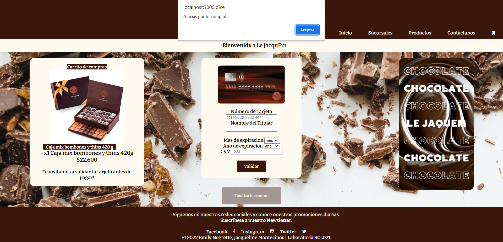

<!--Un título con el nombre de tu proyecto.
Un resumen de 1 o 2 líneas de qué se trata tu proyecto.
La imagen final de tu proyecto.
Investigación UX:
Explicar quiénes son los usuarios y los objetivos en relación con el producto.
Explicar cómo el producto soluciona los problemas/necesidades de dichos usuarios.
Luego colocarás la foto de tu primer prototipo en papel.
Agregar un resumen del feedback recibido indicando las mejoras a realizar.
Imagen del prototipo final.-->
# Le JacquEm Chocolat - :sparkles: Card Validator :sparkles:
Aplicación web para la chocolatería ***Le JacquEm***:chocolate_bar:, donde sus clientes podrán validar su tarjeta de crédito antes de finalizar una compra. 

## Investigación UX :nerd_face:: 

#### 1. Usuarixs y objetivos :family:
Le JacquEm está dirigido principalmente a personas oriundas de Santiago de Chile que comprenden las edades entre 25 y 60 años con un nivel socioeconómico medio, medio-alto. Son personas que se apasionan por el chocolate, que tienen un gusto refinado y que les gusta acudir a lugares exclusivos e innovadores. Por lo general, son usuarios altamente activos online tanto en la web como en diferentes redes sociales como Instagram, Facebook y Twitter.

El objetivo principal de Le JacquEm es llevar la experiencia de comer chocolate a otro nivel, presentando un producto innovador al mercado y satisfaciendo la necesidad de los clientes más exclusivos, así como, mostrandose como una empresa responsable en cuanto a ciberseguridad protegiendo así los datos sensibles de nuestros usuarios.

#### 2. Solución problemas/necesidades :thinking:
Esta aplicación web está destinada a validar las tarjetas de crédito antes de finalizar la compra ofreciendo un método de compra mucho más seguro para el usuario y que asegura la protección de sus datos personales. 

#### 3. Primer prototipo :pleading_face:



#### 4. Prototipo final :  :100: :woman_technologist:


## :star2: :star: Card Validator - Versión Final :star: :star2:






## Validator.js :desktop_computer:
```javascript
const validator = {
  isValid(creditCardNumber) {
  
    let total = 0;
    let ccNumbArray = creditCardNumber.split("").map(Number);
    ccNumbArray.reverse();

    for(let i = 0; i < ccNumbArray.length; i++) {
      if(i % 2 === 1) {
        ccNumbArray[i] = ccNumbArray[i] * 2;
      }
      ccNumbArray = ccNumbArray.map((numb) => numb > 9 ? numb -9 : numb);

      total = total + ccNumbArray[i];   
    }
    if(total % 10 === 0){
      return true;
    } else {
      return false;
    }
  },
  maskify(creditCardNumber) {
    return creditCardNumber.slice(0,-4).replace(/./g,"#") + creditCardNumber.slice(-4);
     }
};
```